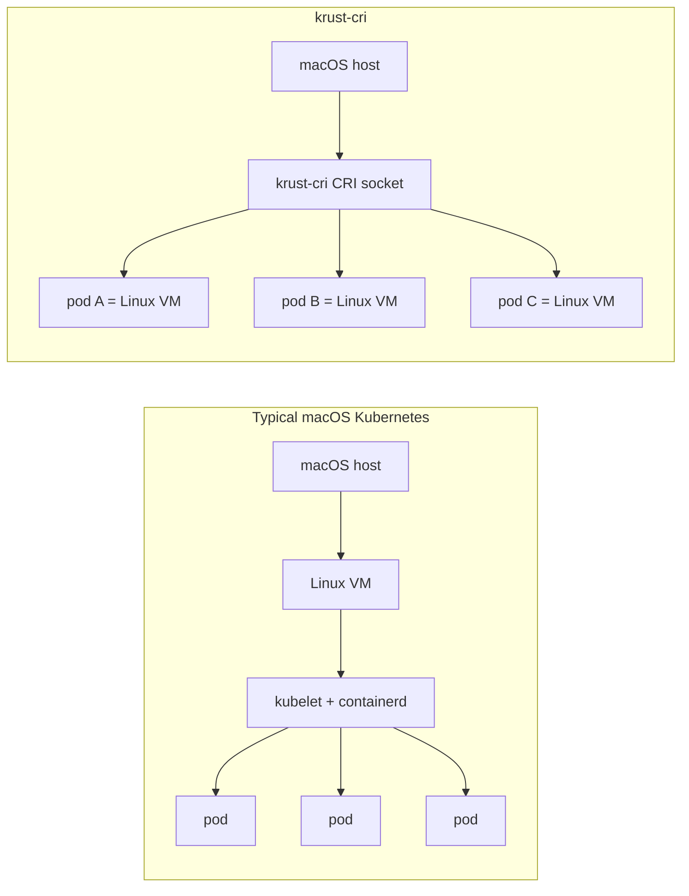

# krust-cri

`krust-cri` is an experimental Kubernetes Container Runtime Interface (CRI)
runtime for macOS.



It exposes Kubernetes `runtime.v1` over a Unix socket and uses Apple's
open-source [Containerization](https://github.com/apple/containerization)
package plus `Virtualization.framework` to run Linux workloads.

Most macOS Kubernetes setups run a Linux VM first, then run pods inside that VM:

```text
macOS host
  -> Linux VM
     -> kubelet/containerd
        -> pod
        -> pod
        -> pod
```

`krust-cri` moves the CRI runtime boundary onto macOS. Kubelet talks to
`krust-cri` on the host, and each Kubernetes PodSandbox becomes its own Apple
Containerization Linux VM:

```text
macOS host
  -> krust-cri CRI socket
     -> pod A = Linux VM
     -> pod B = Linux VM
     -> pod C = Linux VM
```

This is the main idea of the project: not "one Linux VM that contains the
cluster", but "macOS hosts the CRI runtime, and pods are backed by lightweight
Linux VMs".

The current demo still runs k3s/kubelet in a LinuxPod so kubelet itself has a
Linux userspace, but workload pods are created by the macOS-hosted CRI runtime:

```text
k3s/kubelet LinuxPod
  -> host CRI socket relay
  -> krust-cri on macOS
  -> one Linux VM per pod
```

This is a proof of concept, not a production Kubernetes runtime.

## Current Status

Verified on the local development path:

- `krust-cri` starts a CRI `runtime.v1` Unix socket on macOS.
- `crictl`, kubelet, and k3s can talk to that socket.
- A Linux arm64 k3s server can run inside an Apple `LinuxPod`.
- k3s registers a node with `CONTAINER-RUNTIME=krust-cri://0.1.0-mvp`.
- `kubectl apply` can create workload pods through kubelet and `krust-cri`.
- Same-node pod-to-pod TCP works through Apple `VmnetNetwork` pod IPs.
- CRI logs work, including `ReopenContainerLog` for live log rotation.
- Container exit status is visible to kubelet, including non-zero exit codes.
- Basic `restartPolicy: OnFailure` reaches `CrashLoopBackOff` instead of
  runtime create/start errors.
- Live Apple backend `ContainerStats` returns CPU and memory usage from
  `LinuxPod.statistics`.
- Pod sandbox stats aggregate per-container CPU and memory usage for CRI
  `PodSandboxStats`, `ListPodSandboxStats`, and `StreamPodSandboxStats`.
- CRI sandbox DNS config is persisted and passed through to Apple
  Containerization `LinuxPod` resolv.conf setup.
- CRI sandbox port mappings are persisted and exposed in verbose sandbox status
  metadata for future host-port relay work.
- CRI `PortForward` returns a streaming URL backed by the Rust
  `krust-port-forward-bridge` sidecar.
- `crictl port-forward` works against a real `nginx:alpine` container through
  the Rust SPDY bridge.

Still missing or incomplete:

- Kubernetes DNS/service-name resolution and service networking.
- Automatic bridge sidecar startup from `krust-cri`.
- Host-port forwarding/relay and multi-node pod routing.
- Broader resource accounting beyond container and pod sandbox CPU/memory.
- Multi-container/sidecar restart hardening.
- Daemon restart recovery, orphan cleanup, GC, volumes, security context, and
  RuntimeClass behavior.
- Release packaging/signing beyond the local `/private/tmp` smoke path.

## Demo With k3s

The main demo is:

```bash
Scripts/smoke-k3s-single-node.sh
```

It builds a single-node k3s setup where:

1. `krust-cri` runs on the macOS host.
2. k3s runs inside an Apple `LinuxPod`.
3. the k3s kubelet reaches the host CRI socket through Apple socket relay.
4. `kubectl` creates pods.
5. the smoke verifies pod-to-pod networking, logs, exit status, restart behavior,
   live stats, and log reopen.

Recent successful output:

```text
NAME          STATUS   ROLES    AGE   VERSION        INTERNAL-IP    EXTERNAL-IP   OS-IMAGE                         KERNEL-VERSION   CONTAINER-RUNTIME
krust-macos   Ready    <none>   0s    v1.35.0+k3s1   192.168.65.2   <none>        Debian GNU/Linux 12 (bookworm)   6.12.28          krust-cri://0.1.0-mvp

hello-from-k3s-pod-a
OnFailure restart verified: restartCount=1
container stats verified: cpuCoreNs=8709000 memoryBytes=5890048
live log reopen after rotation verified

NAME                   READY   STATUS      RESTARTS     AGE   IP             NODE
krust-k3s-client       0/1     Completed   0            14s   192.168.64.3   krust-macos
krust-k3s-fail         0/1     Error       0            10s   192.168.64.4   krust-macos
krust-k3s-log-writer   1/1     Running     0            4s    192.168.64.6   krust-macos
krust-k3s-restart      0/1     Error       1 (6s ago)   7s    192.168.64.5   krust-macos
krust-k3s-server       1/1     Running     0            16s   192.168.64.2   krust-macos

k3s single-node krust-cri pod-to-pod smoke test complete
```

## Requirements

- Apple silicon Mac.
- macOS 26 and Xcode 26 for Apple Containerization.
- SwiftPM.
- `kubectl`.
- `jq`.
- Local cri-tools binaries under `.local/bin`, including `crictl`.
- Linux arm64 k3s binary at `.local/bin/k3s-linux-arm64`.
- Apple Containerization kernel at `containerization/bin/vmlinux`.
- `vminit:latest` available in the local Apple Containerization image store.

Some local vmnet development flows require the runnable binaries to be copied
and signed under `/private/tmp`; the smoke scripts handle that.

## Build

```bash
Scripts/generate-protos.sh

env CLANG_MODULE_CACHE_PATH="$PWD/.build/clang-module-cache" \
  SWIFTPM_CACHE_PATH="$PWD/.build/swiftpm-cache" \
  swift build --cache-path "$PWD/.build/swiftpm-cache"
```

Run unit tests:

```bash
env CLANG_MODULE_CACHE_PATH="$PWD/.build/clang-module-cache" \
  SWIFTPM_CACHE_PATH="$PWD/.build/swiftpm-cache" \
  swift test --cache-path "$PWD/.build/swiftpm-cache"
```

## Run Manually

State-only backend for quick CRI API checks:

```bash
.build/debug/krust-cri \
  --listen /tmp/krust-cri.sock \
  --state-dir /tmp/krust-cri-state \
  --backend mvp
```

Apple Containerization backend:

```bash
Scripts/prepare-containerization-assets.sh
Scripts/sign-krust-cri.sh

.build/debug/krust-cri \
  --listen /tmp/krust-cri.sock \
  --state-dir /tmp/krust-cri-state \
  --backend containerization \
  --kernel containerization/bin/vmlinux \
  --initfs-reference vminit:latest \
  --containerization-root "$HOME/Library/Application Support/com.apple.containerization"
```

Port-forward bridge sidecar:

```bash
cargo run --manifest-path crates/port-forward-bridge/Cargo.toml -- \
  --listen 127.0.0.1:10443
```

Run `krust-cri` with:

```bash
--port-forward-stream-base-url http://127.0.0.1:10443
```

Then point `crictl` at the socket:

```bash
crictl --runtime-endpoint unix:///tmp/krust-cri.sock info
crictl --runtime-endpoint unix:///tmp/krust-cri.sock images
```

## Other Smoke Tests

```bash
Scripts/smoke-critest-basic.sh
Scripts/smoke-containerization-backend.sh
Scripts/smoke-containerization-network.sh
Scripts/smoke-kubelet-static-pods.sh
Scripts/smoke-k3s-single-node.sh
```

`Scripts/smoke-k3s-single-node.sh` is the most useful end-to-end demo for
people evaluating the project.

## Project Layout

- `Sources/KrustCRI`: CRI server, runtime state, image service, and backends.
- `Sources/KrustKubeletPod`: helper for running kubelet/k3s inside an Apple
  `LinuxPod`.
- `crates/port-forward-bridge`: Rust SPDY port-forward bridge sidecar.
- `Protos/runtime/v1`: Kubernetes CRI protobuf definitions.
- `Scripts`: build, signing, and smoke-test helpers.
- `containerization`: Apple Containerization checkout/submodule.

## Roadmap

The next valuable milestones are:

- make DNS work for normal k3s pods,
- add a minimal service-networking story,
- auto-start and supervise the port-forward bridge,
- implement host-port relay from CRI port mappings,
- broaden stats and pod sandbox stats,
- harden multi-container restart behavior,
- package signing/setup into a repeatable open-source developer flow.

Live post-create `LinuxPod.addContainer` hotplug is not a committed MVP path.
Current public API review did not find a supported runtime virtio block attach
path for the Apple Containerization VZ backend.

## Contributing

Contributions should keep the project evidence-driven:

- prefer small CRI behavior improvements with smoke coverage,
- keep macOS/Apple API assumptions documented,
- run `swift test` before sending changes,
- use the k3s smoke when touching kubelet-facing lifecycle, logs, stats, or
  networking behavior.
