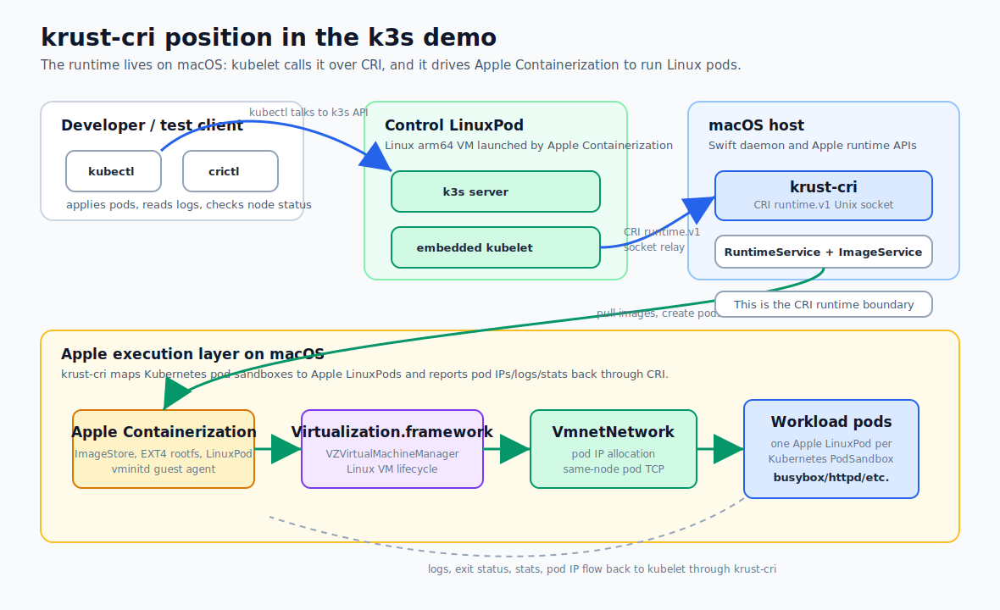

# krust-cri Architecture

`krust-cri` is a small Kubernetes Container Runtime Interface (CRI) runtime for
macOS. Its goal is to let kubelet or k3s operate Kubernetes nodes backed by
macOS and Apple's native virtualization/container APIs.

The project is intentionally different from Lima-style VM management. Lima gives
users Linux machines and lets containerd, Docker, k3s, or other software run
inside those machines. `krust-cri` sits at the Kubernetes CRI boundary: kubelet
calls a macOS-hosted runtime socket, and that runtime translates Kubernetes pod
and container lifecycle requests into Apple Containerization operations.

The current PoC has verified a single-node model: k3s server runs inside an
Apple `LinuxPod`, its kubelet reaches the `krust-cri` Unix socket relayed from
the macOS host, and workload pods run through Apple Containerization with
same-node direct pod-to-pod networking.

The project should stay intentionally narrow: a CRI adapter, state machine, and
Apple Containerization backend. It should not become a general Docker-compatible
runtime or a full containerd clone.



## Goals

- Expose the official Kubernetes CRI `runtime.v1` API over a Unix socket.
- Let `crictl`, kubelet, and k3s use `krust-cri` as the configured runtime
  endpoint.
- Map each Kubernetes pod sandbox to an Apple `LinuxPod`.
- Map each Kubernetes container to a process/container inside that `LinuxPod`.
- Reuse open-source and Apple-provided building blocks wherever possible.
- Keep unsupported Kubernetes/Linux features explicit and honest in CRI status,
  errors, and documentation.

## Non-goals

- Reimplement containerd.
- Become a general Linux VM manager like Lima.
- Provide a Docker-compatible API.
- Support every Linux CNI, namespace, security, and host networking behavior in
  the first versions.
- Hide macOS-specific limitations behind optimistic readiness signals.

## High-level Shape

```text
k3s / kubelet / crictl
    |
    | CRI runtime.v1 over Unix socket
    v
krust-cri daemon
    |
    +-- RuntimeService
    |     - pod sandbox lifecycle
    |     - container lifecycle
    |     - status, stats, events, logs
    |
    +-- ImageService
    |     - pull, list, status, remove images
    |
    +-- State Store
    |     - pods, containers, images
    |     - VM/rootfs/log/network state
    |
    +-- Apple Containerization Backend
          |
          +-- ImageStore
          +-- EXT4Unpacker
          +-- LinuxPod
          +-- VZVirtualMachineManager
          +-- shared VmnetNetwork
          +-- vminitd guest agent
```

For the verified k3s PoC, k3s is not a macOS binary. It is the official Linux
arm64 k3s binary running inside a control `LinuxPod`. Apple socket relay exposes
the macOS-hosted `krust-cri` socket at `/run/krust-cri/krust-cri.sock` inside
that control pod.

## Runtime Backends

`krust-cri` has two runtime backends.

`mvp` is a state-backed backend for fast CRI API development. It is useful for
checking protobuf/gRPC wiring, idempotency, state transitions, and `crictl`
compatibility without booting VMs.

`containerization` is the real execution backend. It uses Apple
`Containerization`, `LinuxPod`, `ImageStore`, `EXT4Unpacker`, and
`Virtualization.framework` to run Linux workloads on macOS. The current PoC
also initializes Apple `VmnetNetwork`, allocates one vmnet interface per pod
sandbox, and reports the assigned pod IP back through CRI.

The CRI service layer should depend on a backend protocol instead of depending
directly on `LinuxPod`. The backend owns Apple-specific details; the CRI layer
owns Kubernetes semantics.

## CRI Mapping

| Kubernetes CRI | krust-cri responsibility | Apple Containerization primitive |
| --- | --- | --- |
| `RunPodSandbox` | create pod record, allocate vmnet interface, persist backend-reported pod IP | `LinuxPod` + `VmnetNetwork.createInterface` |
| `CreateContainer` | resolve image, prepare rootfs, configure process | `LinuxPod.addContainer` |
| `StartContainer` | boot pod VM when needed, start container process | `pod.create`, `pod.startContainer` |
| `StopContainer` | stop process with CRI grace-period semantics | `pod.stopContainer` |
| `RemoveContainer` | release rootfs/log/process bookkeeping | local state + backend cleanup |
| `StopPodSandbox` | stop containers and the pod VM | `pod.stop` |
| `RemovePodSandbox` | release pod state, network allocations, volumes | local state + backend cleanup |
| `PullImage` | pull OCI image and persist image record | `ImageStore` |
| `ImageStatus` / `ListImages` | report image metadata | `ImageStore` + state |
| `ContainerStats` | convert runtime stats into CRI stats | `LinuxPod.statistics` |
| logs | write CRI-compatible log files | host-side log writer |

The preferred model is one VM per Kubernetes `PodSandbox`. This matches
Kubernetes' pod-first design better than one VM per container because sidecars,
shared volumes, optional shared process namespaces, and pod networking all need a
pod-level execution boundary.

## Daemon Boundaries

The daemon should be split into small internal managers:

- `CRIServer`: gRPC transport and generated CRI service adapters.
- `RuntimeService`: Kubernetes pod/container semantics.
- `ImageService`: CRI image semantics.
- `StateStore`: persistent pod, container, image, volume, and network records.
- `ContainerizationBackend`: Apple execution lifecycle.
- `ImageManager`: image pull/resolve/remove and registry auth mapping.
- `RootfsManager`: OCI image unpacking and rootfs lifecycle.
- `LogManager`: CRI log paths, reopen behavior, and future rotation.
- `NetworkManager`: pod IP allocation, vmnet/user-space networking, and cleanup.
- `VolumeManager`: host path, emptyDir, projected file, and pod volume mapping.

This keeps the CRI implementation testable without booting VMs and keeps
macOS-specific code concentrated in the backend.

## State Model

The current MVP can use JSON state. A real kubelet/k3s node should move to
SQLite or another transactional embedded store.

The state store should track:

- pod sandboxes,
- containers,
- images,
- rootfs paths,
- log paths,
- VM identifiers,
- network allocations,
- volumes,
- exit status,
- lifecycle events.

Important properties:

- stop and remove calls are idempotent,
- daemon restart does not lose all kubelet-visible state,
- orphaned VMs and rootfs files can be detected and cleaned up,
- container exit status can be reconstructed,
- kubelet-facing timestamps and status fields remain stable.

## Image and Rootfs Path

The image path should reuse Apple Containerization as much as possible.

```text
PullImage
  -> ImageStore.get(reference, pull: true)
  -> persist digest, reference, size, and timestamps

CreateContainer
  -> resolve image record
  -> EXT4Unpacker.unpack(image)
  -> create per-container rootfs.ext4
  -> attach rootfs to LinuxPod container
```

Future work should add CRI `AuthConfig` support, private registry credentials,
image garbage collection, accurate image filesystem accounting, and digest/tag
semantics that match kubelet expectations.

## Logging

Kubelet expects container logs to exist at CRI-provided log paths and to use the
CRI log format. `krust-cri` should treat log writing as a first-class runtime
contract, not as a debug stream.

Required behavior:

- create parent directories for `ContainerConfig.log_path`,
- write stdout and stderr in CRI log format,
- preserve log path in `ContainerStatus`,
- make `RemoveContainer` tolerant of already-deleted or empty logs,
- implement `ReopenContainerLog` before log rotation is supported.

## Networking Strategy

Networking is the largest compatibility gap between macOS and a Linux
Kubernetes node. The runtime can prove pod/container execution before networking
is complete, but a k3s node or multi-node cluster needs a deliberate networking
architecture.

The design should separate four concerns:

- pod attachment: how a `LinuxPod` gets a network device,
- pod addressing: how the pod receives an IP address and routes,
- host integration: how traffic moves between pod, host, LAN, and cluster,
- Kubernetes integration: how CRI status, pod IPs, DNS, services, and port
  mappings are reported to kubelet.

### Current PoC implementation

The implemented PoC uses Track A, Apple vmnet native networking.

```text
crictl
  -> krust-cri RuntimeService.RunPodSandbox
  -> ContainerizationRuntimeBackend.runSandbox
  -> VmnetNetwork.createInterface(sandboxID)
  -> LinuxPodConfiguration.interfaces = [vmnet interface]
  -> backend returns SandboxRecord with vmnet pod IP
  -> CRI state stores the enriched SandboxRecord
  -> PodSandboxStatus reports the real pod IP
```

Each Kubernetes pod sandbox maps to one Apple `LinuxPod`. Each `LinuxPod` gets
its own vmnet interface from one shared `VmnetNetwork` instance. Containers
inside that pod run in the pod VM and share that pod network attachment.

The CRI layer creates an initial `SandboxRecord`, but it does not invent the
final pod IP. `ContainerRuntimeBackend.runSandbox` returns the backend-enriched
record, and `CRIServices` stores that returned record. This is important because
kubelet and `crictl inspectp` must see the IP that Apple vmnet actually assigned
instead of a placeholder.

The smoke proof is same-node pod-to-pod traffic:

```text
Pod A: busybox httpd on 0.0.0.0:8080
Pod B: wget http://<pod-a-vmnet-ip>:8080

proof: client CRI log contains "hello-from-krust-pod-a"
```

The k3s PoC uses the same network path through Kubernetes API objects:

```text
k3s API creates server pod
  -> kubelet RunPodSandbox/CreateContainer/StartContainer through krust-cri
  -> server pod gets vmnet IP, for example 192.168.64.2

k3s API creates client pod
  -> kubelet creates client pod through krust-cri
  -> client pod wget http://192.168.64.2:8080
  -> client CRI log contains "hello-from-k3s-pod-a"
```

Verified behavior:

- `crictl info` reports `RuntimeReady=true` and `NetworkReady=true` when
  `VmnetNetwork()` initializes.
- `PodSandboxStatus.network.ip` reports the vmnet IP, for example
  `192.168.64.2`.
- Same-node pod-to-pod TCP works through direct pod IP.
- CRI logs capture the client proof in CRI log format.
- k3s can create same-node workload pods through kubelet and `krust-cri`.

Packaging caveat: local development runs should execute the signed binary from
`/private/tmp` or another vmnet-friendly location. Running directly from the
workspace can make `VmnetNetwork()` fail with vmnet status `1001`, matching the
warning in Apple's Containerization examples.

### Kubernetes requirements

A useful Kubernetes node needs these networking properties:

- kubelet sees `NetworkReady=true` only when pod networking actually works,
- each pod sandbox can report a stable pod IP in `PodSandboxStatus`,
- pod DNS is configured from CRI `DNSConfig`,
- pod-to-host traffic works,
- host-to-pod traffic works at least for port mappings and debugging,
- pod-to-pod traffic works on the same node,
- service networking works through kube-proxy or a replacement,
- multi-node clusters can route pod-to-pod traffic across macOS hosts,
- cleanup is idempotent when a pod VM or daemon crashes.

`hostNetwork` should be treated as unsupported initially. macOS host networking
does not provide Linux network namespaces, and pretending otherwise will confuse
kubelet and users.

### Proposed internal model

`krust-cri` should own a `NetworkManager` with a narrow backend interface:

```text
NetworkManager
  |
  +-- allocateSandboxNetwork(sandboxID, podCIDR, portMappings, dnsConfig)
  +-- attachInterfaces(LinuxPodConfiguration)
  +-- configureGuestNetwork(vminitd)
  +-- status()
  +-- releaseSandboxNetwork(sandboxID)
```

The CRI service should not know whether the implementation is vmnet,
user-space, or no-network. It should only persist and return:

```text
SandboxNetworkState
  sandboxID
  mode
  podIP
  gateway
  routes
  dnsServers
  searchDomains
  portMappings
  interfaceIDs
```

The `ContainerizationBackend` then passes the allocated interfaces into
`LinuxPod` and uses the guest agent to apply any routes, DNS files, hosts file,
or sysctls that are not handled automatically.

### Track A: vmnet native

Use Apple `vmnet` and `VZVmnetNetworkDeviceAttachment`.

Status: implemented as the current PoC for same-node pod-to-pod connectivity.

Benefits:

- native Apple stack,
- good fit for `Virtualization.framework`,
- fewer external moving parts.

Costs:

- vmnet requires restricted entitlements for some distribution modes,
- Kubernetes-style port mappings are not automatic,
- Linux CNI behavior does not map directly to macOS host networking,
- `hostNetwork` is likely unsupported or heavily limited.

Architecture:

```text
LinuxPod VM eth0
    |
    | VZVmnetNetworkDeviceAttachment
    v
Apple vmnet shared network
    |
    +-- macOS host NAT/LAN access
    +-- krust-cri port mapping proxy
    +-- optional cluster overlay/routing agent
```

Recommended use:

- best default when entitlement and macOS version support are available,
- good for pod-to-host and pod-to-internet,
- likely the highest-performance native path.

Open design questions:

- how to obtain and distribute the vmnet entitlement,
- how to package/sign the daemon so vmnet works outside development smoke
  scripts,
- whether pod CIDRs can be controlled per node,
- how to expose Kubernetes `PortMapping` from host ports to pod IP/ports,
- how to route pod CIDRs between multiple Mac nodes.

### Track B: documented no-network mode

Run pod/container lifecycle without pod networking.

Benefits:

- ideal for early CRI execution proof,
- no restricted vmnet entitlement,
- simpler smoke tests.

Costs:

- not enough for a complete Kubernetes node,
- `NetworkReady` must remain `false`,
- only local/no-network workloads are realistic.

Architecture:

```text
LinuxPod VM
    |
    +-- no external network device
    +-- CRI lifecycle, image, log, stats tests only
```

Recommended use:

- default smoke-test mode,
- early development mode,
- CI mode if Apple networking entitlements are unavailable.

### Track C: user-space networking

Introduce a `krust-netd` style component that proxies traffic between pod VMs
and the host through vsock or user-mode networking.

Benefits:

- may avoid restricted vmnet entitlement,
- can start with simple port-forward and host connectivity.

Costs:

- lower performance,
- harder pod IP semantics,
- more custom code to support services, DNS, and cross-node traffic.

Architecture:

```text
LinuxPod VM
    |
    | vsock / virtio socket control plane
    v
krust-netd on macOS
    |
    +-- TCP/UDP proxy
    +-- DNS proxy
    +-- port mapping proxy
    +-- optional tunnel to other macOS nodes
```

Recommended use:

- fallback when vmnet is unavailable,
- explicit local development mode,
- possible base for portable multi-node experiments.

Open design questions:

- whether to provide real pod IPs or proxy-only identities,
- UDP support quality,
- service IP handling,
- performance and observability,
- how much behavior belongs in `krust-netd` versus kube-proxy/CNI.

### Track D: hybrid vmnet plus overlay

For multi-node clusters, vmnet alone may not be enough. A hybrid design can use
vmnet for VM attachment and a small overlay/routing agent for cluster traffic.

```text
pod eth0
  -> vmnet node-local network
  -> krust-netd or krust-route on each Mac
  -> encrypted tunnel / routed overlay between Mac nodes
  -> remote pod CIDR
```

This resembles a very small CNI replacement, but it should stay scoped to the
needs of `krust-cri` nodes instead of trying to support every Linux CNI plugin.

### DNS

CRI provides DNS information through sandbox config. `krust-cri` should map this
into the guest using the Containerization guest agent:

- write `/etc/resolv.conf`,
- write `/etc/hosts`,
- preserve search domains and options,
- prefer Kubernetes cluster DNS when kubelet provides it,
- fall back to host DNS only for non-Kubernetes local tests.

DNS readiness should be tested separately from raw network attachment. A pod
with an interface but broken cluster DNS is not ready enough for normal k3s
workloads.

### Port mappings

CRI `PortMapping` should be implemented by a host-side proxy first, not by
trying to make macOS behave like Linux iptables.

Initial design:

```text
host 127.0.0.1:hostPort
  -> krust-port-proxy
  -> podIP:containerPort
```

Later design:

```text
host 0.0.0.0:hostPort
  -> krust-port-proxy
  -> podIP:containerPort
```

The state store should persist port mappings so daemon restart can recreate
listeners or report stale allocations clearly.

### Service networking

For single-node k3s, the simplest path is to let kube-proxy run if it can manage
the required dataplane inside the Linux pod/network environment. On macOS this
may not be enough because kube-proxy normally programs Linux iptables or nftables
on the node.

Possible approaches:

- require a kube-proxy replacement that supports user-space forwarding,
- implement minimal service VIP forwarding in `krust-netd`,
- avoid service networking in the first k3s alpha and test direct pod IPs/port
  mappings first.

Service networking should be a separate milestone from basic pod IP networking.

### Multi-node routing

Multi-node clusters need a per-node pod CIDR and a path between pod CIDRs.

Possible model:

```text
Mac A pod CIDR: 10.244.1.0/24
Mac B pod CIDR: 10.244.2.0/24

pod A -> node A krust-netd -> tunnel/routed link -> node B krust-netd -> pod B
```

The control plane needs a source of truth for node pod CIDRs. Options:

- read kubelet-assigned pod CIDR from the Kubernetes Node object,
- configure a static per-node CIDR in `krust-cri`,
- run a tiny controller that assigns CIDRs to krust nodes.

Multi-node should come after single-node pod IP, DNS, and port mappings are
working.

### Readiness semantics

`NetworkReady=false` is correct when:

- vmnet is unavailable,
- no-network mode is selected,
- pod IP allocation is disabled,
- DNS cannot be configured,
- the selected network backend cannot create a sandbox interface.

`NetworkReady=true` should require:

- network backend initialized,
- sandbox interface allocation works,
- guest IP/route configuration works enough for direct pod IP traffic,
- cleanup/release path works,
- at least one smoke test proves pod-to-host or pod-to-pod connectivity.

DNS is not yet part of the current readiness proof. Before kubelet/k3s alpha,
`NetworkReady=true` should either include DNS verification or expose a more
specific capability signal so users do not confuse direct pod IP connectivity
with full Kubernetes networking.

This avoids a common failure mode: kubelet schedules pods because the runtime
claims readiness, but every workload then fails at networking.

### Recommended networking roadmap

1. Keep no-network fallback honest: `RuntimeReady=true`, `NetworkReady=false`.
2. Keep current vmnet PoC working: initialize `VmnetNetwork`, allocate one
   interface per sandbox, report real pod IPs, and release interfaces on stop.
3. Promote the current inline vmnet handling into a `NetworkManager` and persist
   `SandboxNetworkState`.
4. Add pod DNS configuration through the guest agent.
5. Add host-side port mapping proxy.
6. Add pod-to-host and host-to-pod smoke tests.
7. Evaluate service networking separately.
8. Add multi-node pod CIDR routing or overlay only after single-node behavior is
   reliable.

## Kubelet and k3s Integration

The verified PoC shape is:

```text
macOS host
  krust-cri --backend containerization
    --listen /tmp/krust-cri-k3s-smoke.sock
    --cgroup-driver cgroupfs
    --host-pod-logs-dir /tmp/krust-cri-k3s-logs

control LinuxPod
  /usr/local/bin/k3s server
    --container-runtime-endpoint unix:///run/krust-cri/krust-cri.sock
    --image-service-endpoint unix:///run/krust-cri/krust-cri.sock
    --flannel-backend=none
    --disable-network-policy
    --disable-kube-proxy
    --disable coredns

workload LinuxPods
  one Apple LinuxPod per Kubernetes PodSandbox
  one vmnet interface per PodSandbox
```

The helper executable `krust-kubelet-pod` starts the control `LinuxPod`, mounts
the Linux k3s or kubelet binary into it, relays the host CRI socket into the
guest, and mounts the pod log directory in the locations kubelet and the host
CRI both need.

The main k3s PoC command is:

```bash
Scripts/smoke-k3s-single-node.sh
```

It proves:

- k3s server starts in the control `LinuxPod`,
- the node registers with `CONTAINER-RUNTIME=krust-cri://0.1.0-mvp`,
- Kubernetes API creates two workload pods,
- kubelet creates and starts those pods through `krust-cri`,
- direct pod IP traffic works from client pod to server pod,
- the client pod exits and reaches `Completed`,
- the client CRI log contains `hello-from-k3s-pod-a`.

The later multi-node target shape is:

```bash
k3s agent \
  --container-runtime-endpoint unix:///var/run/krust-cri.sock \
  --image-service-endpoint unix:///var/run/krust-cri.sock
```

or for a single-node experiment:

```bash
k3s server \
  --container-runtime-endpoint unix:///var/run/krust-cri.sock
```

To get there, `krust-cri` needs kubelet-compatible implementations of:

- `RuntimeConfig`,
- `Status`,
- pod/container status and list calls,
- image filesystem info,
- container and pod stats,
- log handling,
- event/error reporting,
- idempotent stop/remove behavior.

`RuntimeReady=true` should mean the daemon, state store, image store, kernel,
init image, and backend are capable of creating a pod.

`NetworkReady=true` should only be reported when pod networking really works.

## Cluster Models

The first target has been proven as a PoC with k3s server in a control
`LinuxPod`:

```text
macOS host
  krust-cri
  control LinuxPod: k3s server + kubelet
  workload LinuxPods: Kubernetes pod sandboxes
```

The later target is a multi-node macOS cluster:

```text
Mac node A: k3s server/agent + krust-cri
Mac node B: k3s agent + krust-cri
Mac node C: k3s agent + krust-cri
```

Multi-node requires pod-to-pod networking across hosts, service networking, DNS,
node IP reporting, kube-proxy compatibility or replacement, and resource
reporting that kubelet accepts.

## Roadmap

### Phase 0: CRI execution MVP

Status: implemented for `crictl` lifecycle smoke testing.

- CRI Unix socket.
- `crictl version/info`.
- image pull.
- pod sandbox lifecycle.
- container create/start/inspect/stop/remove.
- Apple Containerization backend.
- no-network fallback with honest `NetworkReady=false`.
- vmnet same-node pod-to-pod smoke proof when vmnet initializes.

Success criteria:

```bash
crictl pull docker.io/library/alpine:3.20
crictl runp testdata/crictl/sandbox.json
crictl create ...
crictl start ...
crictl inspect ...
crictl stop ...
crictl rm ...
Scripts/smoke-containerization-network.sh
```

### Phase 1: kubelet smoke compatibility

Status: implemented as a focused static-pod PoC.

- Implement `RuntimeConfig`.
- Implement `ImageFsInfo`.
- Improve stats.
- Map container exit status.
- Improve CRI error codes.
- Move state from JSON to SQLite.
- Add launchd-friendly daemon mode.

Success criteria:

```bash
crictl pods
crictl ps
crictl images
crictl stats
kubelet starts without a CRI fatal error
Scripts/smoke-kubelet-static-pods.sh
```

### Phase 2: single-node k3s alpha

Status: implemented as a PoC, not yet a complete alpha.

- Run k3s with `krust-cri` as the runtime endpoint.
- Support basic pod lifecycle through Kubernetes API objects.
- Support `kubectl logs`.
- Support restart policy basics.
- Support private image pull auth minimally.

Success criteria:

```bash
kubectl run alpine --image=alpine:3.20 -- sleep 3600
kubectl get pods
kubectl logs ...
kubectl delete pod ...
Scripts/smoke-k3s-single-node.sh
```

Current caveat: process-exit monitoring is implemented for the current Apple
Containerization backend path, but restart policy behavior, termination reasons,
and log reopen semantics still need hardening before alpha.

### Phase 3: networking alpha

- Harden the current vmnet path.
- Provide durable pod IP reporting through persisted network state.
- Configure pod DNS.
- Support pod-to-host connectivity.
- Keep same-node pod-to-pod connectivity covered by smoke tests.
- Support basic port mappings.

Success criteria:

```bash
kubectl run nginx --image=nginx
kubectl expose pod nginx --port 80
kubectl exec ... -- curl ...
```

### Phase 4: multi-node cluster alpha

- Support multiple macOS nodes running `krust-cri`.
- Provide cross-node pod networking.
- Support service networking.
- Report node resources accurately enough for scheduling.
- Decide kube-proxy compatibility or replacement strategy.

Success criteria:

```bash
kubectl get nodes
kubectl scale deployment ...
kubectl get pods -o wide
```

### Phase 5: hardening

- Crash recovery.
- VM orphan cleanup.
- image and container garbage collection.
- log rotation.
- resource limits and updates.
- volume matrix.
- security context mapping.
- RuntimeClass support.
- Rosetta support for amd64 images on Apple silicon.
- diagnostics bundles.

## Reuse Strategy

Reuse:

- Kubernetes CRI proto,
- Swift gRPC,
- Swift Protobuf,
- `crictl`,
- Apple `Containerization`,
- Apple `LinuxPod`,
- Apple `ImageStore`,
- Apple `EXT4Unpacker`,
- Apple `Virtualization.framework`,
- Apple `vmnet` where available,
- `vminitd` guest agent.

Build in `krust-cri`:

- CRI-to-LinuxPod mapping,
- persistent CRI state,
- Kubernetes log semantics,
- kubelet-compatible status and errors,
- networking policy and integration,
- node install/run scripts,
- diagnostics and smoke tests.

## Architectural Principle

`krust-cri` should be a small CRI adapter plus a reliable state machine over
Apple's native Linux execution substrate.

The main correctness rule is simple: report what works, reject what does not,
and only mark kubelet readiness conditions true when the corresponding runtime
capability is real.
